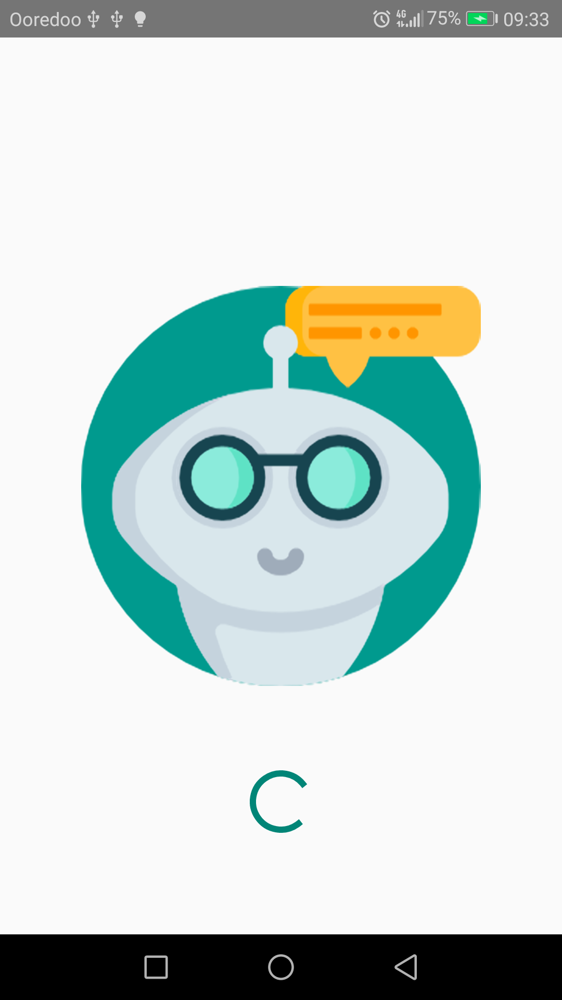
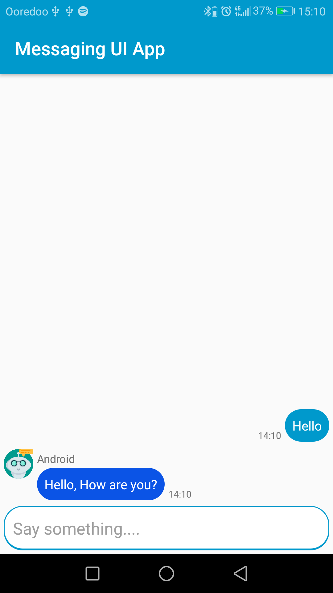

# Messaging UI Android App

This is a simple Android App that showcase the use of RecyclerView to build a messaging app UI. 

## Screenshots

[](screenshots/screenshot1.png)
[](screenshots/screenshot2.png)

    
## Setup
Clone this repository and import into **Android Studio**
```bash
git clone https://github.com/islem19/Messaging-UI-App.git
```

## Libraries and Dependencies
- [RecyclerView](https://developer.android.com/jetpack/androidx/releases/recyclerview)
- Material Design -[Chips](https://material.io/develop/android/components)-


## Maintainers
This project is mantained by:
* [Abdelkader Sellami](https://github.com/islem19)

## Contributing

1. Fork it
2. Create your feature branch (git checkout -b my-new-feature)
3. Commit your changes (git commit -m 'Add some feature')
4. Push your branch (git push origin my-new-feature)
5. Create a new Pull Request


## License
This application is released under GNU GPLv3 (see [LICENSE]()). Some of the used libraries are released under different licenses.
